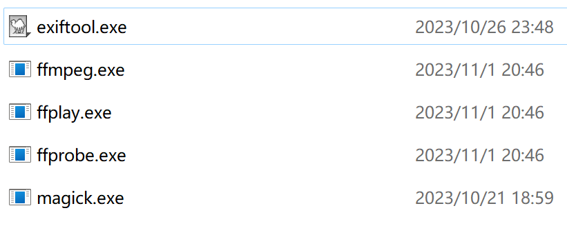

# ocr-apache-tika

- [Apache Tika 官网](https://tika.apache.org/)

**说明**

Apache Tika是一个开源的文本提取和内容分析工具，它支持处理多种文件格式。 它支持多种OCR引擎，包括Tesseract OCR和其他一些商业OCR引擎。

## Apache Tika支持的常见文件格式

使用Apache Tika，你可以对不同文件格式进行内容提取、元数据提取、文本分析等操作。

1. 文本文件：txt、csv、xml、html、markdown等。
2. Microsoft Office文件：doc、docx、ppt、pptx、xls、xlsx等。
3. Adobe PDF文件：pdf。
4. 超文本标记语言文件：htm、html。
5. 媒体文件：音频文件（mp3、wav、flac等）、视频文件（mp4、avi、mov等）。
6. 图像文件：jpg、png、gif、bmp等。
7. 归档文件：zip、tar、gzip、bzip2等。
8. 其他格式：包括电子书格式（如epub、mobi）、CAD文件格式（如dwg、dxf）、地理空间数据格式（如shp、kml）等

Apache Tika支持的一些地理空间数据格式：

1. Shapefile（SHP）：Shapefile是一种常见的地理空间数据格式，用于存储地理矢量数据。Apache
   Tika可以解析Shapefile并提取其中的属性和几何信息。可以提取Shapefile的元数据，如文件名、文件大小、坐标系信息、要素数量等。
2. Keyhole Markup Language（KML）：KML是一种用于描述地理空间数据的XML格式。Apache
   Tika可以解析KML文件并提取其中的地理空间信息。可以提取KML文件的元数据，如文件名、文件大小、KML版本、描述、作者、创建时间、更新时间等。
3. GeoJSON：GeoJSON是一种常用的地理空间数据格式，用于存储地理矢量数据的JSON表示。Apache
   Tika可以解析GeoJSON文件并提取其中的属性和几何信息。可以提取GeoJSON文件的元数据，如文件名、文件大小、要素数量、坐标系信息等。

## 需要下载一下组件

组件下载地址：

```text
https://exiftool.org/
https://github.com/BtbN/FFmpeg-Builds/releases
https://imagemagick.org/script/download.php#windows
```

组件存放路径，并把父目录配置到环境变量:

```text
APACHE_TIKA=E:\App\apache-tika
```

apache-tika目录下组件列表：


## 实例

## Apache Tika 提取pdf文件

引入依赖

```xml

<dependencyManagement>
    <dependencies>
        <dependency>
            <groupId>org.apache.tika</groupId>
            <artifactId>tika-bom</artifactId>
            <version>2.9.1</version>
            <type>pom</type>
            <scope>import</scope>
        </dependency>
    </dependencies>
</dependencyManagement>

<dependencies>
<dependency>
    <groupId>org.apache.tika</groupId>
    <artifactId>tika-core</artifactId>
</dependency>
<dependency>
    <groupId>org.apache.tika</groupId>
    <artifactId>tika-parsers-standard-package</artifactId>
</dependency>
</dependencies>
```

代码实例

```java
public class PdfContentExtractor {

    public static void main(String[] args) {
        File pdfFile = new File("D:\\temp\\pdf\\test.pdf"); // PDF文件路径

        try (InputStream stream = Files.newInputStream(pdfFile.toPath())) {
            // 创建一个解析器
            Parser parser = new AutoDetectParser();
            // 创建一个内容处理器
            BodyContentHandler handler = new BodyContentHandler();
            // 创建元数据对象
            Metadata metadata = new Metadata();
            // 创建解析上下文
            ParseContext context = new ParseContext();

            // 提取PDF内容和元数据
            parser.parse(stream, handler, metadata, context);
            // 打印PDF内容
            System.out.println("PDF内容:");
            System.out.println(handler.toString());

            // 打印PDF的元数据
            System.out.println("PDF元数据:");
            for (String name : metadata.names()) {
                System.out.println(name + ": " + metadata.get(name));
            }
        } catch (Exception e) {
            e.printStackTrace();
        }
    }
}
```
