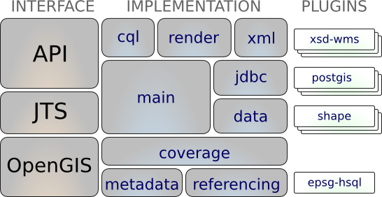

# springboot-gis-geotools

- [geotools 官网(https://geotools.org/)
- [geotools 提供了哪些功能](https://docs.geotools.org/stable/userguide/)

**说明**

GeoTools 是一个开源 (LGPL) Java 代码库的GIS开发工具，它提供符合标准的方法来操作地理空间数据，例如实现地理信息系统。
GeoTools 库数据结构基于开放地理空间联盟 (OGC) 规范。
GeoTools 可以用来ArcSDE（空间数据）的开发，gis相关的文件转换读写，JTS等空间计算方法。

核心功能：

## GeoTools版本与Java版本的对应关系

* GeoTools 29.x 及更高版本：需要使用 Java 11 或更高版本。
* GeoTools 28.x 及更高版本：需要使用 Java 8、Java 11 或更高版本。
* GeoTools 24.x 及更高版本：需要使用 Java 8、Java 11 或更高版本。
* GeoTools 23.x：需要使用 Java 8、Java 11 或更高版本。
* GeoTools 22.x：需要使用 Java 8 或更高版本。
* GeoTools 21.x：需要使用 Java 8 或更高版本。

**Q：为什么只升级到28.5，不使用最新版GeoTools？**

A：因为较新版本对Java版本有要求，目前GeoTools对java 8最高应该就是支持到28.5

## 哪些GeoTools版本与Spring Boot的兼容性已经得到测试和验证？

GeoTools与Spring Boot的版本对应关系并不是直接的一对一关系，因为它们是独立的项目，并且可以在不同的环境中进行集成和使用。

GeoTools和Spring Boot的兼容性通常是由开发者社区和用户社区进行测试和验证的，而官方文档可能没有明确列出所有经过测试的版本对。

然而，根据社区的经验和反馈，以下是一些经常被用于集成的GeoTools版本和Spring Boot版本：

GeoTools 24.x：与 Spring Boot 2.5.x、2.4.x 兼容。
GeoTools 23.x：与 Spring Boot 2.4.x、2.3.x 兼容。
GeoTools 22.x：与 Spring Boot 2.3.x、2.2.x 兼容。
GeoTools 21.x：与 Spring Boot 2.2.x、2.1.x 兼容。

## GeoTools 常用功能

GeoTools是一个强大的开源GIS工具包，提供了许多常用的地理空间功能。以下是GeoTools的一些常用功能：

1. 数据读写和格式转换：GeoTools支持读取和写入各种地理空间数据格式，如Shapefile、GeoJSON、KML、GML、PostGIS、WMS 和 WFS 等，。它提供了API和工具来处理数据的读取、写入和格式转换。
2. 空间数据查询和分析：GeoTools提供了丰富的空间查询和分析功能，包括空间过滤、属性过滤、空间关系操作、缓冲区分析、空间统计等。它允许您执行空间查询和分析操作来解决地理空间问题。
3. 地图投影和坐标转换：GeoTools支持各种地图投影系统和坐标参考系统，并提供了坐标转换功能。它可以帮助您将数据从一个坐标系统转换到另一个坐标系统，以及进行地图投影转换。
4. 空间数据可视化：GeoTools提供了功能强大的地图渲染和数据可视化工具，可以帮助您将地理数据以各种方式可视化，如绘制点、线、面符号、颜色渲染、标签注记等。
5. 空间数据编辑和绘制：GeoTools允许您进行空间数据的编辑和绘制操作。您可以创建、修改和删除地理要素，以及绘制新的地理要素。
6. 空间数据处理和分析：GeoTools提供了许多空间数据处理和分析工具，如空间交叉、缓冲区分析、空间插值、栅格分析等。它可以帮助您进行各种地理空间数据处理和分析任务。
7. 空间分析：包含一系列空间分析功能，如几何对象的操作（交集、并集、差集）、缓冲区分析、距离计算等。
8. OGC 服务支持：全面支持开放地理空间联盟 (OGC) 标准，如 Web Map Service (WMS)、Web Feature Service (WFS) 和 Web Coverage Service (WCS)，便于与其它遵循 OGC 标准的服务进行交互。
9. 地图渲染：利用 Java2D 或者 OpenGL（通过 JGL）进行地图的渲染和可视化，支持图层叠加、符号化、标签放置等地图设计功能。
9. 插件体系：GeoTools 采用模块化设计，用户可以根据需要选择加载不同的模块（或插件），以最小化应用的体积和依赖。

这只是GeoTools提供的一些常见功能的概述，它还提供了许多其他功能和扩展，以满足各种地理空间应用的需求。您可以查阅GeoTools的官方文档和示例代码，以了解更多详细信息和使用方法。

## GeoTools 重要的模块和其功能的简要介绍

GeoTools 重要的模块和其功能的简要介绍：

1. geoapi: 这是GeoTools的核心模块之一，提供了定义地理空间数据和操作的接口和规范。它包含了各种地理空间对象、坐标参考系统、地图投影等相关接口和类。
2. gt-main: 这个模块包含了GeoTools的主要功能和核心类。它提供了数据读写、空间查询、坐标转换、地图渲染、空间分析等基本功能。
3. gt-shapefile: 这个模块提供了对Shapefile格式的支持，包括读取和写入Shapefile文件、获取属性信息、执行空间查询等操作。
4. gt-geojson: 这个模块提供了对GeoJSON格式的支持，包括读取和写入GeoJSON文件、解析GeoJSON数据、执行空间查询等操作。
5. gt-kml: 这个模块提供了对KML格式的支持，包括读取和写入KML文件、解析KML数据、执行空间查询等操作。
6. gt-wms: 这个模块提供了对WMS（Web Map Service）协议的支持，允许您将地理数据以WMS服务的形式发布和使用。
7. gt-jdbc: 这个模块提供了与数据库的交互功能，允许您将地理数据存储在数据库中，并执行空间查询和分析操作。
8. gt-render: 这个模块提供了地图渲染和数据可视化的功能，包括绘制点、线、面符号、标签注记、颜色渲染等。

除了以上列出的模块外，GeoTools 还包含其他一些模块，如gt-coverage、gt-process、gt-epsg-hsql等，它们提供了更专业和特定领域的功能和扩展。

